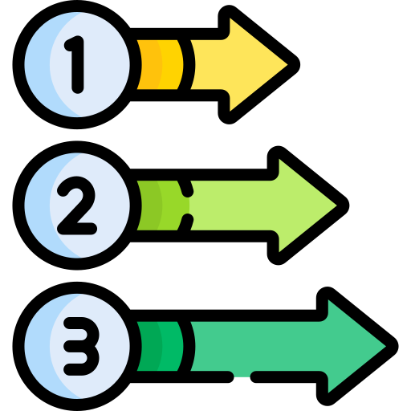

<div align="center" id="logo">
<div>
<h1><b>World Cup 2022</b></h1>

</div>
<br>
</div>

<div align="center">

[![Contributors][contributors-shield]][contributors-url]
[![Forks][forks-shield]][forks-url]
[![Starts][stars-shield]][stars-url]

</div>


<!-- TABLE OF CONTENTS -->
<details>
  <summary style="font-size:18px">Table of Contents</summary> 
  <ol>
    <li>
      <a href="#about-the-project">About The Project</a>
    </li>
    <li><a href="#built-with">Built With</a></li>
    <li>
      <a href="#getting-started">Getting Started</a>
    </li>
    <li><a href="#roadmap">Roadmap</a></li>
    <li><a href="#contributers">Contributers</a></li>
    <li><a href="#Contributing">Contributing</a></li>
    <li><a href="#Demo">Demo</a></li>
  </ol>
</details>

<br>
<!-- Project Description -->
<div id="about-the-project">
<!--  -->
<h2 style="list-style-type: upper-roman;font-size:26px; ">📖  &nbsp; Project Description</h2>
<p>

Our Project is inspired from <b>World Cup Qatar 2022</b>. <a href="#Demo">View Web Demo</a>
<br>

This project is a CST project with the following requirments:
<ul>
<li>Using <b>HTML</b> without HTML5</li>
<li>Using <b>CSS</b> without CSS3</li>
<li>Using <b>Vanilla JavaScript</b> without ES6</li>
</ul>
</p>

<div style="margin-left:10px">
<h3>Objectives</h3>
Practice what we have studied
<ul>
<li><b>HTML</b></li>
<ol style="margin-left:-18px">
<li>Forms</li>
<li>Tables</li>
<li>Image Mapping</li>
</ol>
<li><b>CSS</b></li>
<ol style="margin-left:-18px">
<li>Display</li>
<li>Positions</li>
<li>Box Model</li>
</ol>
<li><b>JavaScript</b></li>
<ol style="margin-left:-18px">
<li>Associative Array</li>
<li>DOM</li>
<li>BOM</li>
<li>Handling Events</li>
<li>Cookies</li>
</ol>
</ul>
</div>
</div>


<div id="built-with">

<span style="list-style-type: upper-roman;font-size:30px; "> &nbsp; Built With</span>
</div>

<br>

<div  style="padding-left:60px;" >

[](https://skillicons.dev)

</div>


<br>

<div id="getting-started">
<!--  -->
<h2 style="list-style-type: upper-roman;font-size:26px; ">🚀 &nbsp; Getting Started</h2>
<div style="margin-left:60px">
<p>To get a local copy up and running follow these simple example steps.</p>
<p>
Git Clone The Repo

``` git clone https://github.com/Maisaa66/World-Cup-2022 ```
</p>
</div>
</div>

<br>
<div id="roadmap" >
<!--  -->
<h2 style="list-style-type: upper-roman;font-size:26px; ">🏃🏻 &nbsp; Roadmap</h2>
</div>

<br>

> ### Home

     ✅ Navbar
     ✅ Main Section
     ✅ Groups
     ✅ Matches
     ✅ History
     ✅ Footer

> ### Matches Schedule

    ✅ Latest Matches
    ✅ Today's Matches
    ✅ Upcoming Matches

> ### Booking 

    ✅ Authentication 🔑 (Using Cookies)
    ✅ Authorization  🔑 (Using Cookies)
    ✅ Booked Matches
    ✅ Available Matches

> ### Sign in  

    ✅ Authentication 🔑 (Using Cookies)
    ✅ Authorization  🔑 (Using Cookies)

> ### Register

    ✅ Authentication 🔑 (Using Cookies)
    ✅ Authorization  🔑 (Using Cookies)


<span id="contributers" ></span>

## 🤝 Contributers
<br>
<a href="https://github.com/Maisaa66/World-Cup-2022/graphs/contributors">
  
</a>


<span id="Contributing" ></span>

 ## ✍ Contributing

<br>
If you have a suggestion that would make this better, please fork the repo and create a pull request. You can also simply open an issue with the tag "enhancement".
Don't forget to give the project a star! Thanks again!

1. Fork the Project
2. Create your Feature Branch (`git checkout -b Maisaa66/World-Cup-2022`)
3. Commit your Changes (`git commit -m 'Add some AmazingFeature'`)
4. Push to the Branch (`git push origin Maisaa66/World-Cup-2022`)
5. Open a Pull Request


<br>

## 🎥 Demo

<br>


<p align="right">(<a href="#logo">back to top</a>)</p>


[contributors-shield]: https://img.shields.io/github/contributors/Maisaa66/World-Cup-2022?style=for-the-badge
[contributors-url]: https://github.com/Maisaa66/World-Cup-2022/graphs/contributors

[forks-shield]: https://img.shields.io/github/forks/Maisaa66/World-Cup-2022?style=for-the-badge
[forks-url]: https://github.com/Maisaa66/World-Cup-2022/network/members

[stars-shield]: https://img.shields.io/github/stars/Maisaa66/World-Cup-2022?style=for-the-badge
[stars-url]: https://github.com/Maisaa66/World-Cup-2022/stargazers